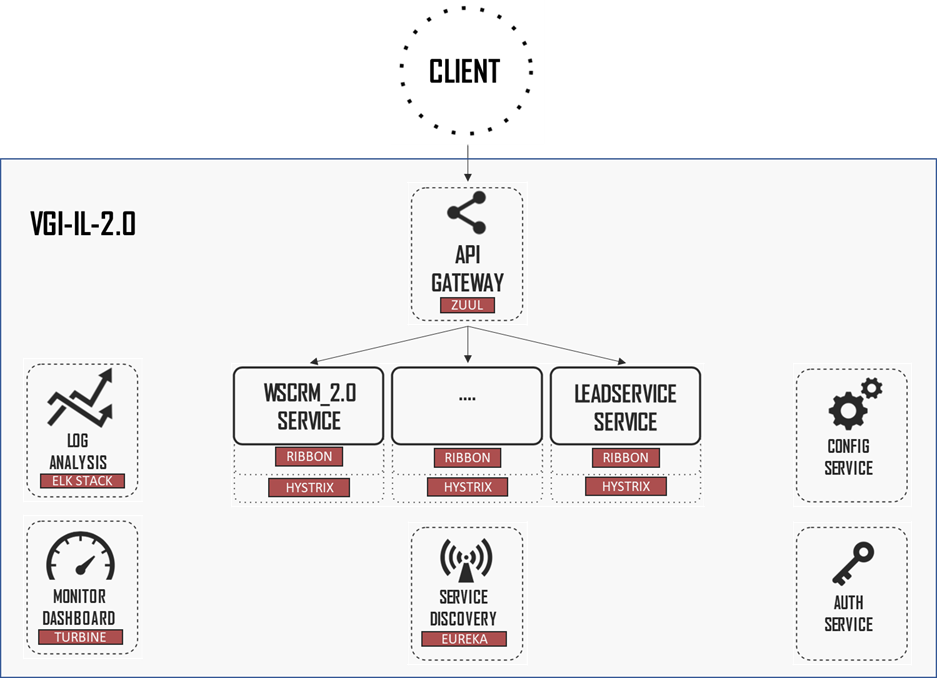
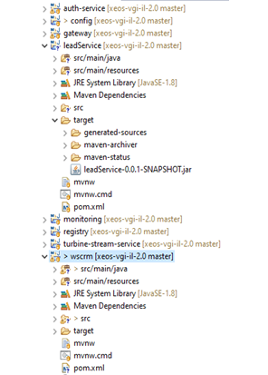

VGI-IL 2.0

Il presente progetto contiene i moduli infrastrutturali che rappresentano i
servizi di base per l’Integration Layer 2.0 di Volkswagen Italia. Tutti i moduli
presenti si basano sui tools e sulle librerie messa a disposizione dal framework
Spring Cloud. Ogni componente viene implementato come singola applicazione java
Spring Boot, eseguibile in modo indipendente dalle altre.

Config service
==============

Si basa su Spring Cloud Config che è un servizio centralizzato, scalabile, per
la gestione delle configurazioni di sistemi distribuiti, nel caso di VGI-IL, i
servizi applicative dell’Integration Layer. La tipologia di repository che
possono essere ‘agganciati’ prevede:

-   **file system locale**

-   repository GIt

-   subversion

nella attuale nostra implementazione usiamo un repository locale, quindi i file
di configurazione vengono caricati a partire da un classpath locale (file) (In
fase di deploy su ambienti di produzione si consiglia l’utilizzo di repository
Git)

Tra le risorse di Config Service è quindi prevista una cartella condivisa
denominata ‘shared’ contenente i file

-   \<*application*\>.yml (proprietà di configurazione per le singole
    applicazioni client) e

-   application.yml (condiviso da tutte le applicazioni client).

Client side
-----------

Dal punto di vista delle singole applicazioni client, l’unico requisito è quello
di prevedere in fase di build la dipendenza da **spring-cloud-starter-config**;
tutto il resto viene generato automaticamente.

Nella singola applicazione non c’è bisogno di gestire nessun tipo di proprietà
‘embedded’, basta fornire nel file bootstrap.yml il nome dell’applicazione e
l’url del Config service:

esempio:

*spring:*

*application:*

*name: newlead-service*

*cloud:*

*config:*

*uri: http://config:8888*

*fail-fast: true*

**Le configurazioni e le proprietà dei singoli moduli applicativi (servizi)
possono essere modificate dinamicamente utilizzando l’annotation \@RefreshScope
sul componente interessato.**

In pratica si può procedere manualmente in questo modo:

-   modificare la proprietà sul file delle cartella ‘shared’;

-   inviare una request del tipo curl -H "Authorization: Bearer \#token\#"
    -XPOST

Il processo può essere automatizzato.

Auth service
============

La gestione della sicurezza è stata completamente sganciata dal singolo
componente applicativo e concentrata su questo server che fornisce OAuth2
tokens ai resource services (servizi VGI-IL) .

Il componente Auth Server è usato sia per eventuali user authorization che per
gestire la sicurezza delle chiamate tra i vari servizi all’interno della
soluzione.

Stiamo utilizzando il ‘Password Credentials Grant Type’ per la user
authorization (ad oggi non è stato implementato nessun componente che la
utilizza) e ‘Client Credentials Grant Type’ per l’ authorization dei
microservizi.

Esempio client side:

*\@PreAuthorize("\#oauth2.hasScope('server')")*

*\@RequestMapping(value = "leads/{name}", method = RequestMethod.GET)*

*public List\<DataPoint\> getLeadsByDealer(\@PathVariable String name) {*

*return leadsService.findByDealerName(name);*

*}*

Ogni client in VGI-IL avrà uno scope: **server **per i servizi di backend,
e *ui* per il browser. In questo modo viene controllato e gestito l’accesso
esterno ai singoli servizi.

Nella versione attuale, i dati relative a client-id, secret e scope vengono
gestiti ‘in-memory’; dovrà essere analizzata con il cliente la modalità di
memorizzazione dei dati (file, repository, database, etc.).

I dati utilizzati per le utenze sono memorizzati su istanza mongodb (cartella
auth-mongodb con relativa imagine Docker)

API Gateway
===========

Questo componente rappresenta il singolo entry point per tutto il sistema
VGI-IL.

Le configurazioni previste per il modulo API Gateway consentono di implementare
un singolo entry point sul sistema IL, utilizzato per il routing delle varie
request verso gli appropriati servizi di back-end o per l’invocazione multipla
di servizi e l’aggregazione del loro risultato.

L’API Gateway può essere utilizzato anche per fase di autenticazione, stress
test, migrazione di servizi, monitoraggio del traffico.

Su VGI-IL viene utilizzato il componente Zuul di Netflix, opensource inserito
nel framework Spring Cloud.

In questa prima versione Zuul viene utilizzato per il routing delle richieste e
viene abilitato mediante l’annotation \@EnableZuulProxy.

Di seguito un esempio di routing ‘prefix-based’ per un ipotetico servizio
lead-service:

*zuul:*

*routes:*

*lead-service:*

*path: /leads/\*\**

*serviceId: lead-service*

*stripPrefix: false*

In pratica con queste direttive tutte le request che iniziano con /leads saranno
redirette a lead-service. Notiamo che non ci sono indirizzi hardcoded. Zuul
usa il meccanismo di Service discovery per identificare le istanze di
lead-service, così come Circuit Breaker e Load Balancer (vedi di seguito).

Service discovery
=================

Il modulo Service discovery consente di realizzare il rilevamento automatico
sulla rete delle istanze dei vari servizi VGI-IL, consentendo così la gestione
dell’auto-scaling e relativa assegnazione automatica degli indirizzi, degli
aggiornamenti e anche delle eventuali situazioni di failures.

Il service Registry utilizzato in VGI-IL con Spring Cloud è Netflix Eureka.

Eureka implementa il ‘client-side discovery pattern’, cioè è la parte client che
è responsabile di determinare la service location per le varie istanze presenti
di ogni servizio e gestire così anche il load-balancing tra di esse.

Utilizzando Spring Boot, il Registry Eureka viene costruito mediante la
dipendenza del progetto da spring-cloud-starter-eureka-server e l’annotation
\@EnableEurekaServer , definendo le opportune configuration properties.

Lato client il tutto viene abilitato mediante l’annotation
\@EnableDiscoveryClient e il file **bootstrap.yml** con il nome
dell’applicazione:

*spring:*

*application:*

*name: lead-service*

Allo startup, l’applicazione si registra sull’ Eureka Server e fornisce i
metadati quali host e porta, health indicator, URL, home page etc. Eureka riceve
notifiche (heartbeat) da ognuna delle istanze di un determinato

servizio. Dal momento in cui tali notifiche cessano, per uno stabilito
intervallo di tempo, l’istanza viene rimossa dal registry.

Eureka mette a disposizione anche una semplice interfaccia web per la verifica
delle varie istanze e della loro disponibilità sul sistema.

Progetti
========

La figura seguente riporta tutti i progetti attualmente in sviluppo e rilasciati
sul repository GIT VGI-IL.

Ogni applicazione è costituita da un progetto maven (pom.xml) con la possibilità
di lanciare test automatici in fase di build degli artefatti.

Oltre a quelli infrastrutturali sopra elencati, sono presenti anche i progetti
relativi alla wave0 della soluzione VGI-IL2.0, ovvero:

**wscrm** e

**leadservice** (*esempio da confermare*). leadservice servirà anche da
‘template’ per i servizi REST che verranno identificati in fase di analisi.

La build del singolo progetto produce una applicazione java Spring Boot
eseguibile da linea di commando:

*java -jar [opzioni] \<nome_applicazione\>*

Oltre ai 4 componenti infrastrutturali di base, sono stati inseriti anche altri
2 componenti di servizio (*non previsti per la wave0 ma comunque funzionanti in
versione demo ed eventualmente da ottimizzare con le wave successive*):
**monitoring** e **turbine-stream-service**, per la gestione delle funzioni di
monitoring dashboard dell’intero Sistema (richiesto server messaggistica per le
notifiche, es. rabbitMq).

Immagini DOCKER
===============

Ognuno dei progetti sopra elencati contiene il file denominato **Dockerfile**
con le direttive per la build della propria docker image.

Qui di seguito l’esempio per il modulo *auth-service*:

*FROM java:8-jre*

*MAINTAINER Christian Novelli*

*ADD ./target/auth-service.jar /app/*

*CMD ["java", "-Xmx200m", "-jar", "/app/auth-service.jar"]*

*EXPOSE 5000*

-   **FROM **java:8-jre— con questa riga sui dice a Docker che l’immagine da
    creare si basa sull’immagine java:8-jre presente sul repository pubblico
    (Docker Hub). Questa immagine contiene tutte le dipendenze e i componenti
    prerequisito per l’esecuzione di qualsiasi applicazione Java.

-   **ADD** ./target/auth-service.jar /app/ — il primo parametro indica il path
    relativo dell’applicazione SpringBoot che vogliamo inserire nel container
    (*auth-service.jar*). Il secondo parametro */app/* indica la directory del
    container dove copiare l’applicazione.

-   **CMD** ["java", "-Xmx200m", “-jar", “/app/auth-service.jar"] — in pratica
    si dice a Docker di eseguire l’applicazione: il primo parametro è il comando
    da lanciare (*java*) gli altri i parametri di esecuzione.

-   **EXPOSE** 5000 — è la direttiva per dire a Docker che il container esporrà
    la porta 5000, la stessa in questo caso utilizzata dall’applicazione
    auth-service.

Build
-----

Quindi, una volta posizionati nel folder che contiene *Dockerfile*, con il
comando:

*docker build -t authservice-img .*

è possibile lanciare la build dell’immagine docker dell’applicazione, nel caso
di esempio auth-service (il parametro dopo il -t specifica il nome della docker
image che si vuole creare). Per ulteriori opzioni di build fare riferimento alla
documentazione Docker.

A questo punto l’immagine potrà essere esportata in formato .tar per essere
utilizzata su container locali, oppure (caso VGI-IL) si procede con il suo
caricamento su Repository privato e alla sua pubblicazione sui vari ambienti di
esecuzione (ad esempio, per VGI-IL, AWS container).

Esecuzione immagine docker
--------------------------

La singola imagine docker viene eseguita con il commando:

docker run -p\<port:port\> \<image\>

Di seguito elenco dei comandi docker per il lancio dei servizi infrastrutturali
basati sulla versione Dockerfile presente nei vari moduli:

*docker run -p8888:8888 --env-file ../envFile.env config-img*

*docker run -p27017:27017 --env-file ../envFile.env auth-mongodb-img*

*docker run -p5000:5000 --env-file ../envFile.env auth-service-img*

*docker run -p8761:8761 --env-file ../envFile.env registry-img*

*docker run -p4000:4000 --env-file ../envFile.env gateway-img*

Per lanciare anche il servizio di test leadService:

*docker run -p8899:8899 --env-file ../envFile.env lead-service-img*

TEST
====

Il progetto contiene le collection Postman per il test di corretto funzionamento
dell’infrastruttura.

Di seguito il file JSON (*VGI-IL 2.0 PS.postman_collection.json*):

{

"info": {

"_postman_id": "3b5128c9-55f3-49ca-a80e-4ec052af079e",

"name": "VGI-IL 2.0 PS",

"schema": "https://schema.getpostman.com/json/collection/v2.1.0/collection.json"

},

"item": [

{

"name": "auth-service TOKEN",

"request": {

"auth": {

"type": "basic",

"basic": [

{

"key": "username",

"value": "leadService",

"type": "string"

},

{

"key": "password",

"value": "password",

"type": "string"

}

]

},

"method": "POST",

"header": [],

"body": {

"mode": "formdata",

"formdata": [

{

"key": "grant_type",

"value": "client_credentials",

"type": "text"

}

]

},

"url": {

"raw": "http://192.168.1.102:5000/uaa/oauth/token",

"protocol": "http",

"host": [

"192",

"168",

"1",

"102"

],

"port": "5000",

"path": [

"uaa",

"oauth",

"token"

]

}

},

"response": []

},

{

"name": "currentAccount",

"request": {

"auth": {

"type": "bearer",

"bearer": [

{

"key": "token",

"value": "f95590d0-444f-447e-a874-a0bd1601bb0c",

"type": "string"

}

]

},

"method": "GET",

"header": [],

"url": {

"raw": "http://localhost:5000/uaa/users/current",

"protocol": "http",

"host": [

"localhost"

],

"port": "5000",

"path": [

"uaa",

"users",

"current"

]

}

},

"response": []

},

{

"name": "sendLead",

"request": {

"auth": {

"type": "bearer",

"bearer": [

{

"key": "token",

"value": "7bba003e-1947-42c8-b0fd-199dad4bd277",

"type": "string"

}

]

},

"method": "POST",

"header": [

{

"key": "",

"value": "",

"type": "text",

"disabled": true

}

],

"body": {

"mode": "formdata",

"formdata": [

{

"key": "message",

"value": "prova",

"type": "text"

}

],

"options": {

"raw": {

"language": "json"

}

}

},

"url": {

"raw": "http://192.168.1.102:8899/sendLead",

"protocol": "http",

"host": [

"192",

"168",

"1",

"102"

],

"port": "8899",

"path": [

"sendLead"

]

}

},

"response": []

},

{

"name": "Test funzionamento LeadService",

"request": {

"auth": {

"type": "bearer",

"bearer": [

{

"key": "token",

"value": "7bba003e-1947-42c8-b0fd-199dad4bd277",

"type": "string"

}

]

},

"method": "POST",

"header": [],

"url": {

"raw": "http://192.168.1.102:8899/prova",

"protocol": "http",

"host": [

"192",

"168",

"1",

"102"

],

"port": "8899",

"path": [

"prova"

]

}

},

"response": []

}

],

"protocolProfileBehavior": {}

}

Prima dell’import su Postman va modificato l’IP impostato per le chiamate.
